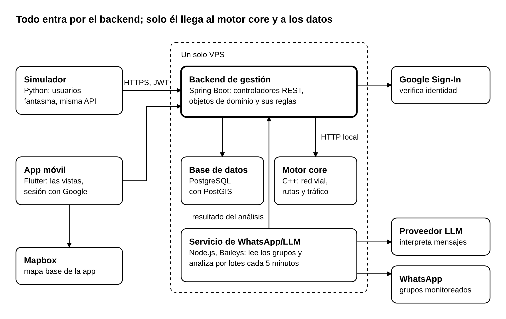

# Visión general

[Índice de la arquitectura](README.md)

## Metas y restricciones de arquitectura

La arquitectura responde a los requisitos no funcionales de la matriz y respeta las restricciones que la Visión ya fijó. Cada meta tiene una respuesta concreta en el diseño.

### Metas

| Meta | Requisito | Cómo responde la arquitectura |
| --- | --- | --- |
| Un evento reportado llega a los demás conductores en 5 a 10 segundos | RNF-01 | La app consulta los eventos cada 5 segundos. No se usan WebSocket ni notificaciones push |
| La ruta se calcula en menos de 3 segundos | RNF-02 | El cálculo corre en el motor C++, que mantiene la red vial cargada en memoria |
| Los surtidores cercanos se listan en menos de 3 segundos | RNF-03 | El estado de cada surtidor ya está guardado cuando el conductor pregunta; la búsqueda por cercanía la resuelve PostGIS |
| El estado de un surtidor se actualiza en menos de 6 minutos | RNF-04 | El servicio de WhatsApp/LLM analiza cada 5 minutos y envía el resultado directo al backend |
| El inicio de sesión tarda menos de 3 segundos | RNF-05 | Tras elegir la cuenta de Google, la app hace una sola llamada al backend |
| Reportar un evento toma 3 toques como máximo | RNF-06 | La vista de reporte trae el tiempo preseleccionado |
| El origen del dato de cada surtidor es visible | RNF-07 | El origen (WhatsApp o Conductores) es un atributo obligatorio del estado de combustible |
| Solo entran usuarios con sesión | RNF-08 | Todos los controladores del backend exigen un JWT válido, salvo el de inicio de sesión |
| No se aceptan reportes, votos ni confirmaciones repetidos | RNF-09 | La regla vive en los objetos de dominio: un voto por conductor y evento, sin reportes ni confirmaciones duplicados en poco tiempo |
| No se exponen datos de otros usuarios | RNF-10 | Ninguna respuesta del backend incluye quién reportó, votó o confirmó, ni la posición de otro conductor |
| Los mensajes de WhatsApp no guardan remitente y se borran | RNF-11 | El servicio de WhatsApp/LLM descarta número y nombre al recibir el mensaje y elimina el texto tras analizarlo |
| El simulador no daña los datos reales | RNF-12 | Todo dato simulado queda marcado y puede eliminarse por separado |
| La ubicación se obtiene solo con la app abierta | RNF-13 | La telemetría la envía la app únicamente mientras está en pantalla |

### Restricciones

- **Plataforma.** App en Flutter para Android e iOS, backend en Java con Spring Boot, motor core en C++, servicio de WhatsApp/LLM en Node.js por depender de Baileys, simulador en Python y mapas de Mapbox.
- **Idioma.** Toda la interfaz está en español.
- **Infraestructura.** Un solo VPS básico aloja el backend, el motor core, el servicio de WhatsApp/LLM y la base de datos, así que cada componente debe consumir poca memoria.
- **Cobertura.** El sistema opera solo en la mancha urbana de Tarija y solo sobre vías vehiculares.
- **Privacidad.** La ubicación nunca se obtiene en segundo plano. Solo se monitorean grupos de WhatsApp autorizados por su administrador, y al proveedor del LLM se envían únicamente el texto y la fecha de cada mensaje.
- **Acceso.** No existen contraseñas propias: la identidad la verifica Google.
- **Plazo y equipo.** Cinco integrantes y una Construcción que va del 2 de octubre al 30 de noviembre de 2026. Cada componente tiene un responsable, por eso las fronteras entre componentes deben quedar claras.

## Componentes, despliegue y comunicación

ChuroViaje tiene cinco piezas propias, una base de datos y cuatro servicios externos. El backend Java es la única puerta de entrada: la app, el servicio de WhatsApp/LLM y el simulador hablan con él, y solo él habla con el motor core y con la base de datos.

*Figura: Componentes de ChuroViaje · 5 piezas propias, 1 base de datos, 4 servicios externos. Fuente editable: [ARQ-01_Componentes.puml](diagramas/ARQ-01_Componentes.puml).*

Las flechas van de quien llama a quien responde.

### Componentes propios

| Componente | Tecnología | Qué hace | Qué no le corresponde |
| --- | --- | --- | --- |
| App móvil | Flutter, SDK de Mapbox | Muestra las pantallas, captura toques y GPS, guarda reportes sin conexión y los últimos eventos conocidos | Decidir reglas de negocio |
| Backend de gestión | Java, Spring Boot | Recibe todas las peticiones, aplica las reglas en los objetos de dominio, guarda los datos y emite el JWT | Calcular rutas, leer WhatsApp |
| Motor core | C++ | Mantiene la red vial, calcula y recalcula rutas, y analiza la telemetría para detectar congestión | Atender a la app directamente, guardar datos de usuarios |
| Servicio de WhatsApp/LLM | Node.js, Baileys | Lee los grupos, guarda los mensajes pendientes, los analiza por lotes cada 5 minutos y envía el resultado | Cambiar el estado de un surtidor por su cuenta: eso lo decide el backend |
| Simulador | Python | Genera usuarios fantasma que envían eventos y telemetría por la misma API que la app | Escribir directo en la base de datos |
| Base de datos | PostgreSQL, PostGIS | Guarda conductores, eventos, votos, surtidores y estados de combustible; resuelve búsquedas por cercanía | Contener reglas de negocio |

### Servicios externos

| Servicio | Para qué se usa | Quién lo usa |
| --- | --- | --- |
| Google Sign-In | Verificar la identidad del conductor | La app obtiene el token de identidad; el backend lo valida |
| Mapbox | Mapa base de la app | La app, con su SDK |
| Grupos de WhatsApp | Fuente de los avisos de combustible | El servicio de WhatsApp/LLM, en modo solo lectura |
| Proveedor del LLM | Interpretar los mensajes por lotes | El servicio de WhatsApp/LLM |

### Comunicación entre componentes

| De | A | Medio | Qué viaja |
| --- | --- | --- | --- |
| App móvil | Backend | HTTPS, REST con JSON, JWT en cada petición | Reportes, votos, confirmaciones de recarga, telemetría y consultas de eventos, rutas y surtidores |
| Backend | Motor core | HTTP local con JSON | Solicitudes de ruta y de recálculo, lecturas de telemetría, eventos y congestión vigentes |
| Servicio de WhatsApp/LLM | Backend | HTTP local con JSON | Resultado estructurado del análisis de cada lote |
| Simulador | Backend | La misma API REST que usa la app, con credenciales de prueba | Eventos y telemetría simulados |
| Backend | Google | HTTPS | Validación del token de identidad |
| Servicio de WhatsApp/LLM | Proveedor del LLM | HTTPS | Texto y fecha de los mensajes pendientes, sin datos del remitente |

La app nunca llama al motor core ni al servicio de WhatsApp/LLM. Los eventos nuevos llegan a los demás conductores porque cada app consulta al backend cada 5 segundos.

### Despliegue

El backend, el motor core, el servicio de WhatsApp/LLM y la base de datos corren en el mismo VPS. Solo el backend queda expuesto a internet, por HTTPS; el motor core y la base de datos aceptan conexiones únicamente desde la propia máquina. El simulador se ejecuta desde la computadora de un desarrollador o desde un contenedor de pruebas.
