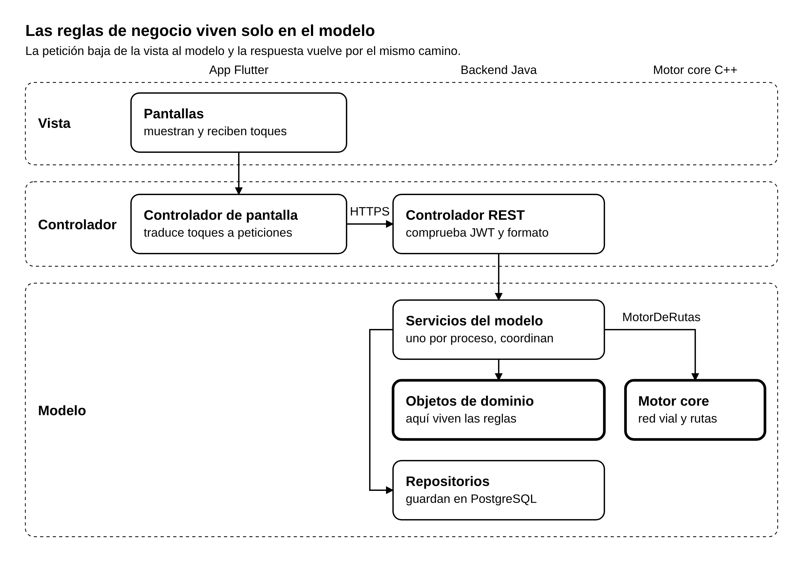

# Aplicación de MVC

[Índice de la arquitectura](README.md)

ChuroViaje usa un solo MVC que atraviesa los componentes: la vista está en la app, el modelo en el servidor y el controlador en las dos orillas. Las reglas de negocio viven únicamente en el modelo.

*Figura: Capas MVC de ChuroViaje · una vista, dos controladores y el modelo en el servidor. Fuente editable: [ARQ-02_CapasMVC.puml](diagramas/ARQ-02_CapasMVC.puml).*

Los dos recuadros resaltados son los únicos lugares donde hay reglas de negocio: los objetos de dominio del backend y el motor core.

## Qué es cada capa

| Capa | Dónde vive | Qué hace | Qué no hace |
| --- | --- | --- | --- |
| Vista | Pantallas de la app Flutter | Muestra datos y captura los toques del conductor | Llamar al backend, calcular vigencias, decidir qué es válido |
| Controlador de pantalla | App Flutter, uno por pantalla o flujo | Convierte un toque en una petición, guarda el estado de la pantalla, programa la consulta de cada 5 segundos y maneja la cola sin conexión | Aplicar reglas de negocio |
| Controlador REST | Backend, con Spring | Comprueba el JWT y el formato de la petición, llama al modelo y traduce el resultado a una respuesta HTTP | Aplicar reglas de negocio, acceder a la base de datos |
| Modelo | Backend y motor core | Contiene los objetos de dominio, sus reglas y sus datos | Saber de pantallas o de HTTP |

## Cómo se organiza el modelo

- **Objetos de dominio.** Cada uno guarda sus datos y hace cumplir sus propias reglas. Un `EventoVial` sabe si sigue vigente y si un conductor ya lo votó; nadie más lo calcula por él.
- **Servicios del modelo.** Hay uno por proceso. Coordinan a los objetos de dominio y a los repositorios para completar un caso de uso, pero no deciden reglas.
- **Repositorios.** Guardan y recuperan objetos de dominio en PostgreSQL. No contienen reglas.
- **Motor core.** Es la parte del modelo que conoce la red vial. El backend lo usa a través de un único objeto, `MotorDeRutas`, de modo que el resto del modelo no sabe que detrás hay una llamada HTTP.

## Reglas de reparto

1. **Una regla, un solo lugar.** Toda regla de negocio está en un objeto de dominio del backend o del motor core.
2. **La app no es fuente de verdad.** Lo que la app valida es para comodidad del conductor; el backend vuelve a validarlo siempre.
3. **Excepción sin conexión.** La app repite una sola regla, porque debe funcionar sin red: la vigencia de un reporte que espera en la cola local (HU-02). Usa los tiempos de vigencia que el backend le entrega, no valores propios.
4. **Un solo camino.** Una petición va de la vista al controlador y del controlador al modelo; la respuesta vuelve por el mismo camino. Los controladores no se llaman entre sí.
5. **Clientes sin vista.** El servicio de WhatsApp/LLM y el simulador no tienen vista: entran al backend por un controlador REST, igual que la app.
6. **Reglas del monitoreo.** El servicio de WhatsApp/LLM cumple las reglas de su propio proceso (qué guarda, cuándo analiza, qué descarta). Lo que se acepta como estado de un surtidor lo decide el modelo del backend.

## Vistas de la app

| Vista | Proceso | Qué muestra y qué permite |
| --- | --- | --- |
| Inicio de sesión | CU-08 | El botón «Iniciar sesión con Google». Es la única vista disponible sin sesión |
| Mapa principal | CU-02 | El mapa con los eventos vigentes por color, el buscador y la barra inferior (Mapa, Eventos, Surtidores) |
| Reportar evento | CU-01 | Tipo de evento y hace cuánto ocurrió, con «Hace 5 minutos» marcado; ajuste manual del punto si falla el GPS |
| Lista y detalle de eventos | CU-02 | Tipo y antigüedad de cada evento, los botones para votar real o falso y la marca de confirmado |
| Cómo llegar | CU-03 | Origen, destino y paradas; la ruta con su tiempo y su distancia; el botón para iniciar |
| Navegación activa | CU-03, CU-04 | La indicación de giro y, si hay congestión, el aviso de ruta alternativa para aceptar o rechazar |
| Surtidores | CU-05 | Cada surtidor con su estado por tipo de combustible, la fila, el origen del dato y su fecha |
| Pregunta de recarga | CU-05 | «¿Acabas de recargar combustible?» y, si la respuesta es sí, los tipos de combustible |

CU-06 no tiene vista: es un proceso automático. CU-07 se opera por línea de comandos o con un archivo de configuración.
