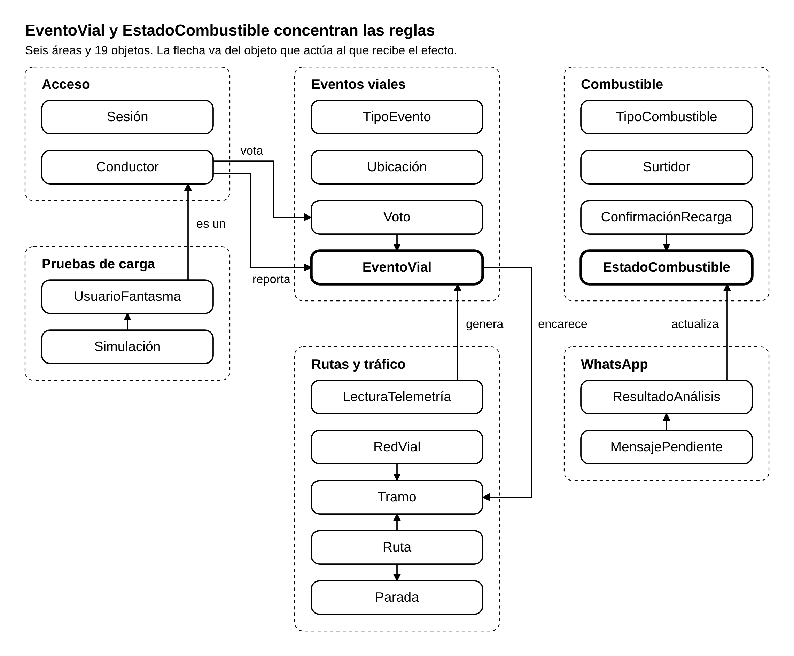

# Modelo de dominio

[Índice de la arquitectura](README.md)

El modelo tiene 19 objetos de dominio repartidos en seis áreas. Cada objeto guarda sus datos y hace cumplir las reglas que le pertenecen; las reglas completas, con su código, están en [04_reglas](04_reglas/README.md).

*Figura: Modelo de dominio · 6 áreas, 19 objetos y los vínculos entre áreas. Fuente editable: [ARQ-03_ModeloDominio.puml](diagramas/ARQ-03_ModeloDominio.puml).*

Casi todo termina en dos objetos: lo que reportan los conductores y la telemetría acaba en un `EventoVial`, y lo que llega de WhatsApp y de las recargas acaba en un `EstadoCombustible`.

## Acceso

| Objeto | Qué representa | Datos principales | Reglas que cuida | Vive en |
| --- | --- | --- | --- | --- |
| Conductor | La persona que usa la app | Identificador interno, identificador de su cuenta de Google, fecha de alta, marca de simulado | Hay un solo conductor por cuenta de Google y se crea en el primer inicio de sesión. Su identidad nunca sale en una respuesta a otro usuario | Backend |
| Sesión | El permiso temporal para usar la app | Conductor, momento de emisión, momento de expiración | Sin sesión vigente no se atiende ninguna petición. Al expirar obliga a iniciar sesión otra vez | Backend, que la emite; la app la guarda |

## Eventos viales

| Objeto | Qué representa | Datos principales | Reglas que cuida | Vive en |
| --- | --- | --- | --- | --- |
| TipoEvento | El catálogo de lo que se puede reportar | Nombre, color en el mapa, vigencia en minutos, si es reportable | Define cuánto dura un evento de ese tipo y si un conductor puede reportarlo | Backend |
| EventoVial | Un hecho en la vía que afecta a quien conduce | Tipo, ubicación, momento en que ocurrió, momento de registro, reportante, origen (Conductor o Telemetría), estado, votos «real» y «falso», marca de simulado | Sabe si sigue vigente, rechaza duplicados del mismo conductor y cambia de estado según los votos | Backend |
| Voto | La opinión de un conductor sobre un evento | Conductor, evento, valor (real o falso), fecha | Un solo voto por conductor y evento | Backend |
| Ubicación | Un punto del mapa | Latitud, longitud, cómo se obtuvo (GPS o ajuste manual) | Debe caer dentro de la mancha urbana de Tarija | Backend y motor core |

Un `EventoVial` pasa por cuatro estados:

- **Activo.** Fue aceptado y se muestra en el mapa y en la lista.
- **Confirmado.** Recibió votos «real». Se sigue mostrando, con su marca de confirmado.
- **Retirado.** Acumuló la cantidad definida de votos «falso». Deja de mostrarse.
- **Vencido.** Superó la vigencia de su tipo. Deja de mostrarse.

## Rutas y tráfico

| Objeto | Qué representa | Datos principales | Reglas que cuida | Vive en |
| --- | --- | --- | --- | --- |
| RedVial | Las calles vehiculares de Tarija | Intersecciones y tramos | Solo contiene vías vehiculares; fuera de ella no hay ruta | Motor core |
| Tramo | Un trozo de calle entre dos intersecciones, en un sentido | Extremos, nombre de la calle, longitud real, tipo de vía, nivel de tráfico actual | Solo se recorre en su sentido. Su costo sube con el nivel de tráfico | Motor core |
| Ruta | El camino propuesto al conductor | Origen, destino, paradas, tramos, distancia, tiempo estimado, estado | Pasa por las paradas en el orden indicado. Nunca usa un tramo a contramano ni una vía peatonal | Motor core, que la calcula; la app la conserva mientras dura la navegación |
| Parada | Un punto intermedio de la ruta | Ubicación, orden | Mantiene el orden que eligió el conductor | Motor core y app |
| LecturaTelemetría | Una medición de posición y velocidad | Posición, velocidad, precisión del GPS, momento, marca de simulada | Se descarta si la precisión es mala o la velocidad es imposible. Nunca se muestra a otro usuario | Backend, que la recibe; motor core, que la analiza |

Una `Ruta` está Calculada cuando se muestra, Activa mientras el conductor navega y Terminada al llegar o cancelar. No se guarda en la base de datos: el sistema no conserva historial de rutas.

La congestión no es un objeto aparte. Cuando el motor core la detecta por telemetría, el backend la registra como un `EventoVial` de tipo Congestión con origen Telemetría. Así sigue las mismas reglas de vigencia, aparece en el mapa y pesa en el cálculo de rutas como cualquier otro evento. Un conductor no puede reportarla: solo la registra el sistema.

## Combustible

| Objeto | Qué representa | Datos principales | Reglas que cuida | Vive en |
| --- | --- | --- | --- | --- |
| Surtidor | Una estación de servicio del catálogo | Nombre, alias con los que la gente lo nombra, ubicación | Solo los surtidores del catálogo pueden recibir un estado | Backend |
| TipoCombustible | El catálogo de combustibles | Gasolina, Diesel, Gasolina Premium, Diesel ULS y Desconocido | Todo dato de un surtidor lleva uno de estos tipos. Desconocido solo puede venir de WhatsApp | Backend |
| EstadoCombustible | Lo último que se sabe de un combustible en un surtidor | Surtidor, tipo, disponibilidad (disponible o agotado), fila aproximada si se conoce, origen (WhatsApp o Conductores), fecha del dato | Para cada surtidor y tipo vale el dato más reciente. Pasada su vigencia se muestra como «sin información reciente» | Backend |
| ConfirmaciónRecarga | El aviso de un conductor que acaba de recargar | Conductor, surtidor, tipo de combustible, fecha | Marca ese combustible como disponible con origen Conductores. No se repite en poco tiempo | Backend |

## Monitoreo de WhatsApp

| Objeto | Qué representa | Datos principales | Reglas que cuida | Vive en |
| --- | --- | --- | --- | --- |
| MensajePendiente | Un mensaje de un grupo que espera análisis | Identificador, grupo, fecha y hora, texto, estado (pendiente, procesado o descartado) | Nunca guarda número ni nombre del remitente. Su texto se borra al analizarse o al superar su vigencia | Servicio de WhatsApp/LLM |
| ResultadoAnálisis | Lo que el LLM entendió de un lote | Por cada aviso: surtidor, tipo de combustible, estado, fila si se menciona y fecha del mensaje | Solo se acepta el aviso que nombra un surtidor del catálogo y cumple el formato | Servicio de WhatsApp/LLM, que lo arma; backend, que lo valida |

## Pruebas de carga

| Objeto | Qué representa | Datos principales | Reglas que cuida | Vive en |
| --- | --- | --- | --- | --- |
| Simulación | Una ejecución del simulador | Cantidad de usuarios fantasma, rutas, eventos a enviar, límites permitidos | Rechaza parámetros inválidos o excesivos antes de empezar | Simulador |
| UsuarioFantasma | Un conductor ficticio | Credenciales de prueba, ruta que recorre | Todo lo que envía queda marcado como simulado y puede borrarse aparte | Simulador; para el backend es un Conductor con marca de simulado |

## Catálogos y valores iniciales

| Catálogo o valor | Contenido | Fuente |
| --- | --- | --- |
| Tipos de evento que reporta un conductor | Accidente, control policial, bloqueo y otro | Decisión [D-10](08_decisiones_parametros.md) |
| Tipo de evento que registra el sistema | Congestión, solo a partir de la telemetría | Decisión [D-04](08_decisiones_parametros.md) |
| Vigencia de los eventos | Congestión, 30 minutos. Accidente, control policial, bloqueo y otro, 60 minutos | CU-02, sección 8 |
| Colores de evento | Rojo para accidentes y azul para controles policiales. Los de bloqueo, otro y congestión los fija el diseño | Visión 1.2.1, HU-03 |
| Tiempos que ofrece el reporte | Ahora mismo, hace 5 minutos (marcado), hace 10 minutos y hace 30 minutos | HU-01 c.2 y decisión [D-09](08_decisiones_parametros.md) |
| Tipos de combustible | Gasolina, Diesel, Gasolina Premium, Diesel ULS; Desconocido cuando el mensaje no lo indica | CU-05, sección 8 |
| Vigencia del estado de un surtidor | 6 horas sin dato nuevo | CU-05, sección 8 |
| Vigencia de un mensaje pendiente | 30 minutos sin analizar | CU-06, sección 8 |
| Ciclo de análisis de mensajes | Cada 5 minutos, solo si hay pendientes | CU-06 |
| Consulta de eventos desde la app | Cada 5 segundos | CU-02, sección 8 |
| Red vial | Extracto de OpenStreetMap de la mancha urbana de Tarija, solo con vías vehiculares | Decisión [D-08](08_decisiones_parametros.md) |
| Niveles de tráfico de un tramo | Fluido, moderado, congestionado y muy congestionado, con costo multiplicado por 1,0, 1,5, 2,5 y 4,0 | Prototipo de `05_pro/PruebaCalculoRuta`, a ajustar con pruebas |
| Velocidad esperada por tipo de vía | Vías rápidas, 50 a 60 km/h. Avenidas principales, 35 a 45 km/h. Zonas residenciales, 15 a 25 km/h | `05_pro/CalculoVelocidad` |

Los valores que los casos de uso dejan para la Construcción (votos «falso» para retirar un evento, umbral de telemetría para declarar congestión) se reúnen en [08_decisiones_parametros.md](08_decisiones_parametros.md).
